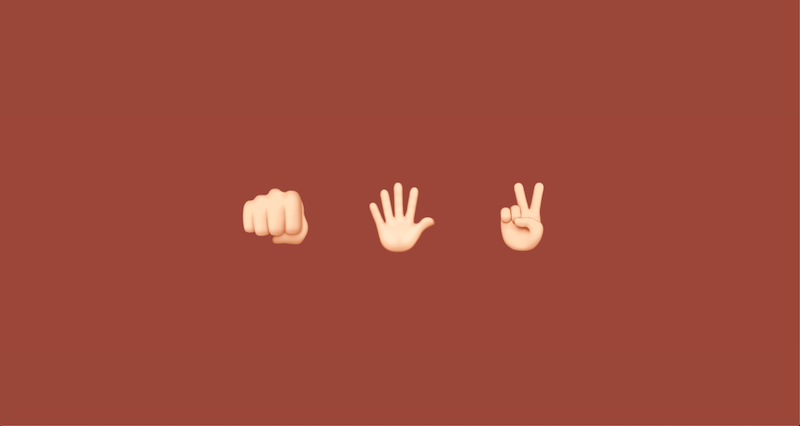

## Janken -  Rock Paper Scissors Japanese version

 

### Description
---
Janken (じゃん拳) is the Japanese version of Rock Paper Scissors. Players say the phrase (“saisho wa gu, jan-ken-pon!“) to start a game. If result is a draw, players say ("aiko desho!"), and on the "sho!" play again.

### Main Features
---
- Built With HTML5, CSS, SASS, and JavaScript
- Cross Browser Support
- Mobile friendly
- Clean Code
- Documentation included
- Code easy to customize
- Includes CSS animation
 

### Credits
---
- Google Fonts
